# UTS Pemrograman Mobile - Faiz Fazdlih

Aplikasi Android ini dikembangkan sebagai tugas **UTS Pemrograman Mobile**.  
Project ini menampilkan implementasi komponen Android seperti **Splash Screen, Fragment, Bottom Navigation**, serta beberapa fitur halaman seperti **Biodata, Kontak, Kalkulator, Cuaca, dan Berita.**

---

## Identitas Mahasiswa
| Nama | NRP | Kelas |
|-------------|------|------|
| Faiz Fazdlih Dwi Putra Pambudi | 152023080 | AA |

---

## Fitur Aplikasi

### Splash Screen
Menampilkan foto, nama, dan NRM pengguna. Tampil selama **5 detik** sebelum masuk ke halaman utama.

  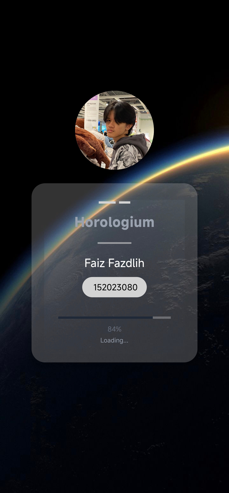

---

### Biodata
Form input biodata mahasiswa dengan validasi dan tampilan dialog hasil input. Menggunakan **DatePickerDialog**, **Spinner**, **Radio Button** serta dialog peringatan jika data belum lengkap.

  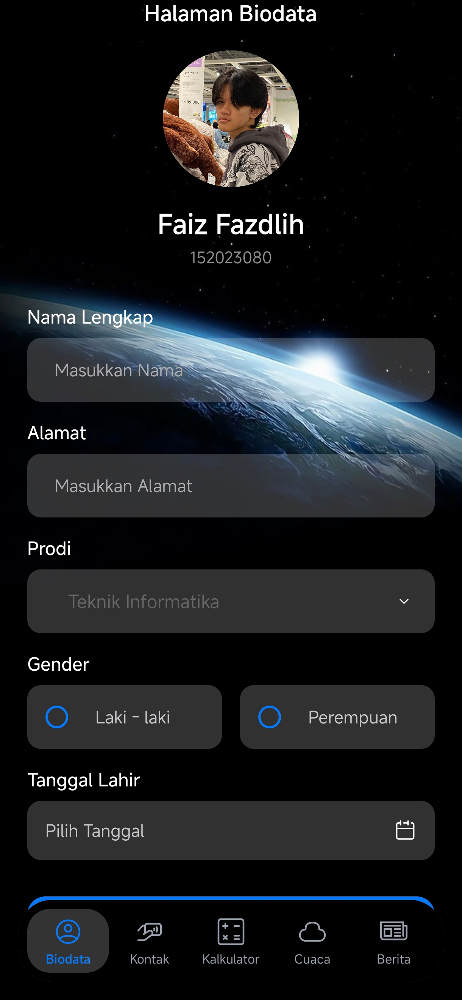
  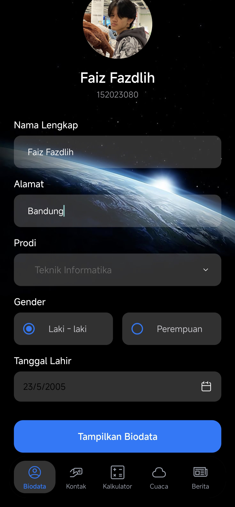
  

---

### Kontak
Halaman yang menampilkan daftar kontak menggunakan **RecyclerView**. Terdapat fitur **pencarian (search)** untuk mempermudah pengguna menemukan kontak tertentu berdasarkan nama.

  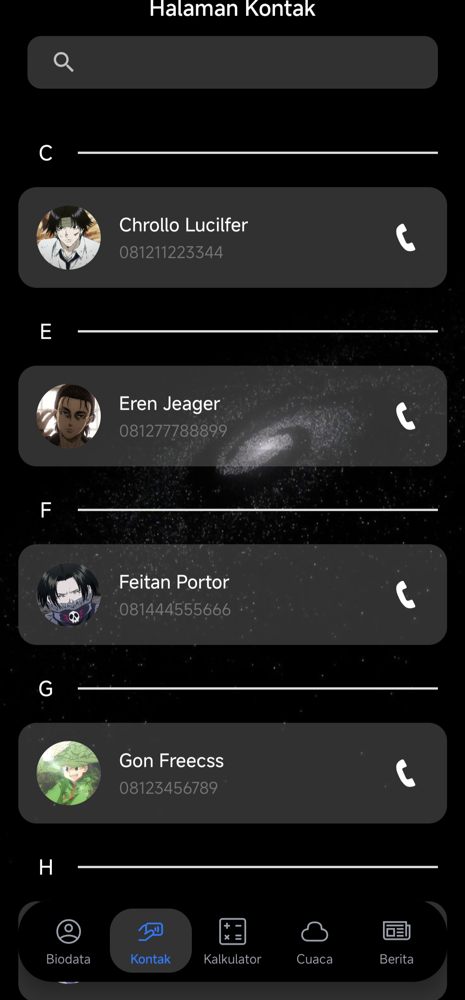
  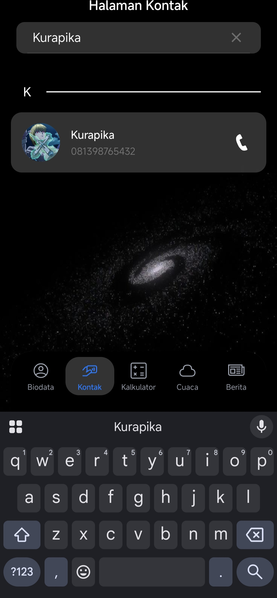

---

### Kalkulator
Kalkulator multifungsi dengan operasi **+, −, ×, ÷, %, √, dan x²**.

  
  
  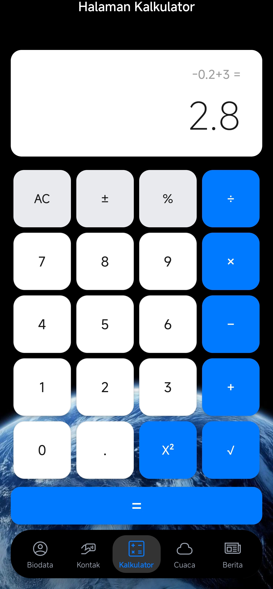

---

### Cuaca
Menampilkan informasi cuaca **tanpa API (data statis)**. Data mencakup **nama kota, suhu, dan kondisi (Cerah, Berawan, atau Hujan)**. Dilengkapi dengan **Spinner untuk mengganti kota**, sehingga pengguna bisa melihat kondisi cuaca dari beberapa kota berbeda secara langsung.  

  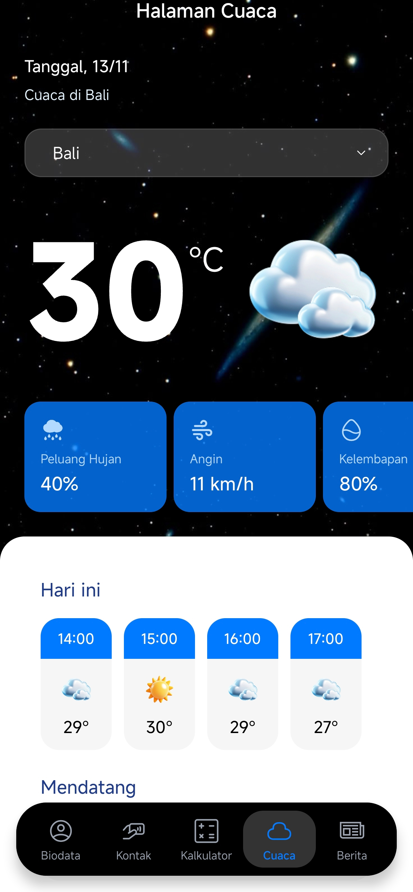
  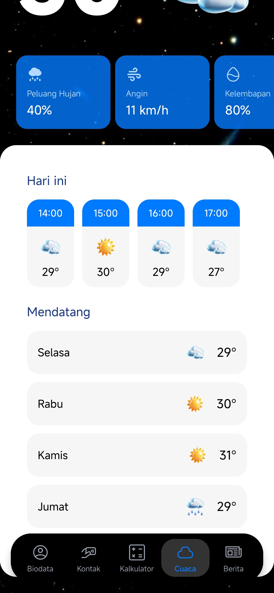

---

### Berita
Menampilkan daftar berita dengan gambar, judul, dan ringkasan. Klik salah satu berita untuk membuka **popup detail berita lengkap**.

  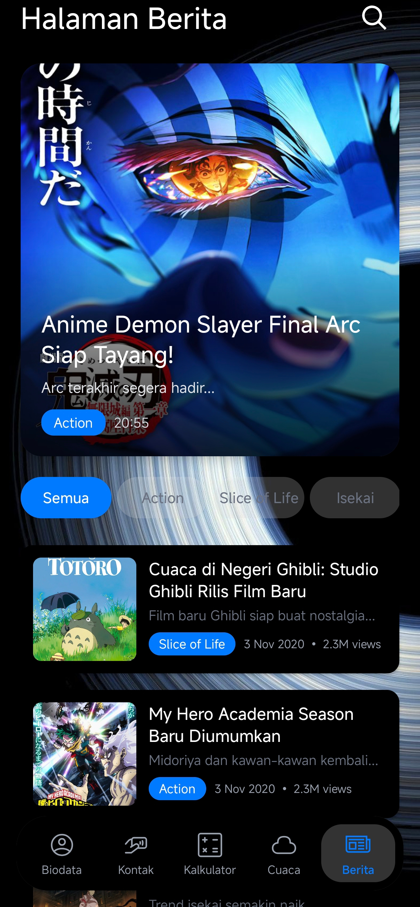
  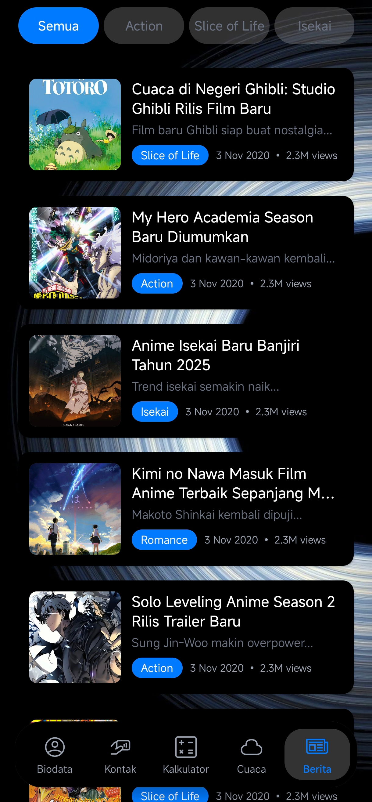
  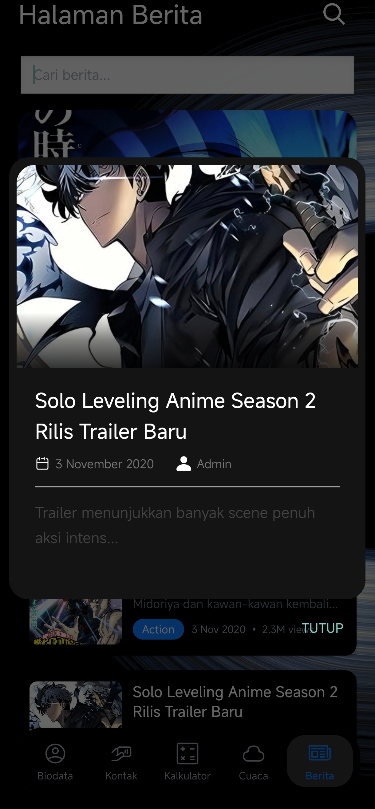

---

## Teknologi yang Digunakan
- Kotlin  
- Android Studio  
- View Binding  
- RecyclerView  
- CardView  
- DatePickerDialog  
- Handler & Intent  
- Custom Drawable (Ripple, Shape)

---

## 🔗 Link Repository
[Source code di GitHub](https://github.com/FaizFazdlih/uts_mobile)
